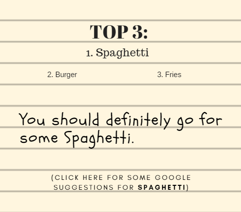

# PickForUs
Hanging out with friends? Everyone is indecisive and you all don't know where to go? 
Get everyone on this website and anonymously share your thoughts on what to do for the rest of the day!

# What's so special about this? Can't we just share our thoughts in real life?
It is most likely that deep down inside you and your friends that you have somewhere you would want to go.
This website will extract the information needed from you and your friends to finalize and get the most wanted option.
And really if everyone is indecisive, who is the leader of the group? THIS WEBSITE!

# How do you extract the most wanted option?
### You are given 60 seconds to put in your thoughts, therefore the website is trying to get the first thing that comes to you and your friends minds.

For example if we want to choose a food place, we would select "Picking Food".

In this scenario, seems like everyone is okay with whatever. The website analyzes the data and tries to narrow down options and finally giving the best option.

From the database, the website narrowed down to only selecting food and checks for the most common cuisine/food (If someone says "I don't want burger" it would detect the "don't want (insert food here)" and would not include burger).

So in the end we are given these options!

