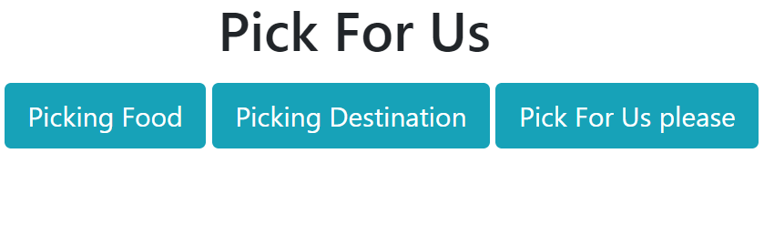
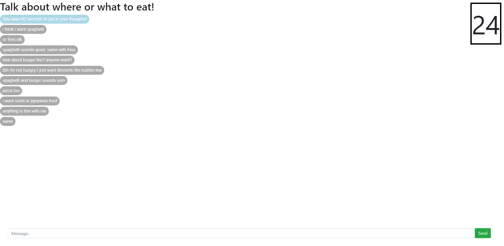
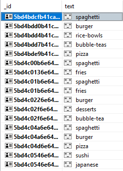

# HOW TO RUN
Prerequisites:
- Needs mongodb database (var url = 'mongodb://localhost:27017/chat_database';) where chat_database is the database name.
- yarn (or npm, I used yarn)

Steps (in a terminal, I used Visual Studio Code):
1. git clone https://github.com/cnsaavedra/PickForUs.git
3. Work on PickForUs directory.
4. yarn install
5. yarn start

**Works on localhost:3000**

# PickForUs
Hanging out with friends? Everyone is indecisive and you all don't know where to go? 
Get everyone on this website and anonymously share your thoughts on what to do for the rest of the day!

# What's so special about this? Can't we just share our thoughts in real life?
No one will be the decisive friend and finalize a place. It is also most likely that deep down, you and your friends have an idea what you all really want.
This website will extract the information needed from you and your friends to finalize and get the most wanted option.
And really if everyone is indecisive, who is the leader of the group? THIS WEBSITE!

# How do you extract the most wanted option?
### You are given 60 seconds to put in your thoughts, therefore the website is trying to get the first thing that comes to you and your friends minds.

- For example if we want to choose a food place, we would select "Picking Food".
  

- In this scenario, seems like everyone is okay with whatever. The website analyzes the data and tries to narrow down options and finally giving the best option.

- From the database, the website narrowed down to only selecting food and checks for the most common cuisine/food (If someone says "I don't want burger" it would detect the "don't want (insert food here)" and would not include burger).

- So in the end we are given these options!
- The "You have duplicates, but we fixed that for you" is towards the message that had burger in the same sentence (Or could be spammed by the same guy. Keep in mind if it's from the same guy who wants to spam a certain cuisine/food in the chat then not everyone indecisive and therefore that person can plan the meal for everyone). It is a way to disallow from repeating the same words accidentally.
